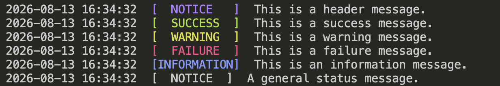
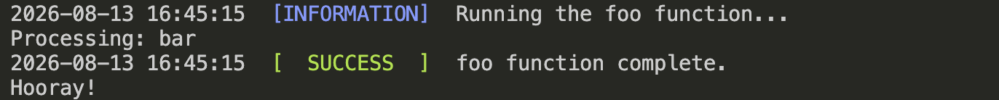

# 🎨 PTColors.jl

[](https://julialang.org)
[](LICENSE)

`PTColors` is a lightweight Julia package designed to add color-coded, timestamped messages to terminal output with minimal effort. It is useful for command-line applications, scripts, simulations, and other projects that need readable status messages.

The package provides information, success, warning, failure, and header messages without requiring users to work directly with ANSI escape codes. It also includes convenience macros and callback handling for common application workflows.

## 🚦 Project Status

| Workflow                  | Status |
| ------------------------- | ------ |
|  Testing Suite          | [](https://github.com/ec-intl/PTColors.jl/actions/workflows/ci.yml) |
|  Documentation          | [](https://github.com/ec-intl/PTColors.jl/actions/workflows/docs.yml) |
|  Guard Main Branch     | [](https://github.com/ec-intl/PTColors.jl/actions/workflows/guard.yml) |
|  Code Quality Checker   | [](https://github.com/ec-intl/PTColors.jl/actions/workflows/super-linter.yml) |

## 📋 Requirements

- Julia 1.11 or later

## 📦 Installation

Install PTColors from Julia’s General registry:

```julia
using Pkg
Pkg.add("PTColors")
```

## 🧩 Components

The package currently has the following structure:

```plaintext
.
├── .devcontainer/
├── .github/
│   └── workflows/
├── build_docs/
│   ├── src/
│   │   ├── assets/
│   │   ├── api.md
│   │   └── index.md
│   ├── make.jl
│   ├── Manifest.toml
│   └── Project.toml
├── environments/
├── scripts/
│   ├── ci/
│   └── dev/
├── src/
│   └── PTColors.jl
├── test/
├── .dockerignore
├── .gitignore
├── CHANGELOG.md
├── docker-compose.yml
├── Dockerfile
├── LICENSE
├── Manifest.toml
├── Project.toml
├── README.md
└── VERSION
```

## 🖍️ Example

Load the package:

```julia
using PTColors
```

Use the message functions:

```julia
headermsg("This is a header message.")
okmsg("This is a success message.")
warnmsg("This is a warning message.")
failmsg("This is a failure message.")
infomsg("This is an information message.")
defaultmsg("This is a general message.")
```

This produces timestamped terminal messages with consistent status labels. The predefined message functions color their labels, while `defaultmsg` is uncolored unless a color is supplied.

> **Terminal colors:** PTColors uses standard ANSI color categories rather than
> fixed RGB values. The exact shades depend on the terminal emulator and its
> active color theme. This example was captured in the VS Code terminal using
> the Monokai theme.



The package also provides convenience macros:

```julia
@ptinfo "Simulation started."
@ptok "Simulation completed."
@ptwarn "A fallback value is being used."
@pterror "The simulation failed."
```

## ⚙️ Running a Callback

The `messages` function prints an information message, runs a callback, and then prints either a success or failure message.

```julia
# Define the callback that PTColors will run.
function foo(bar)
    println("Processing: ", bar)
end

# Run the callback with start, success, and failure messages.
status = messages(
    "Running the foo function...",
    "foo function complete.",
    "foo function experienced a problem!",
    foo,
    "bar";
    exception = Exception,
)

# Interpret the status returned by messages.
if status == 0
    println("Hooray!")
else
    println("Oh no!")
end
```

This produces terminal output similar to the following:



The function returns `0` when the callback succeeds and `1` when it throws an expected exception. Unexpected exceptions are rethrown.

## 🛠️ Main API

| Name         | Purpose                                                |
| ------------ | ------------------------------------------------------ |
| `timestamp`  | Return the current date and time as a formatted string |
| `defaultmsg` | Print a standard timestamped message                   |
| `headermsg`  | Print a bright magenta header message                  |
| `infomsg`    | Print a bright blue information message                |
| `okmsg`      | Print a bright green success message                   |
| `warnmsg`    | Print a bright yellow warning message                  |
| `failmsg`    | Print a bright red failure message                     |
| `messages`   | Run a callback with status and failure handling        |
| `@ptinfo`    | Print an information message                           |
| `@ptok`      | Print a success message                                |
| `@ptwarn`    | Print a warning message                                |
| `@pterror`   | Print a failure message                                |

## 🧪 Testing

Run the complete test suite from the repository root:

```bash
julia --project=. -e 'using Pkg; Pkg.instantiate(); Pkg.test()'
```

## 🚀 Development

Development work is based on the `staging` branch. Create feature branches from `staging` and open pull requests back into `staging`.

## 📄 License

This project is licensed under the [Apache License 2.0](LICENSE).
