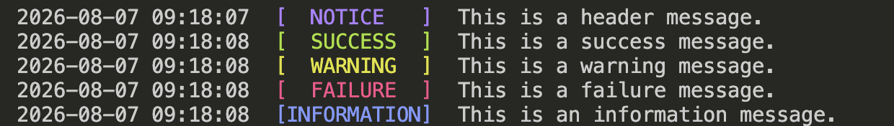

# PTColors.jl

```@raw html
<div class="ptcolors-hero">
    <p class="ptcolors-eyebrow">Readable Julia terminal output</p>
    <p class="ptcolors-tagline">
        PTColors provides lightweight, color-coded, timestamped messages for
        command-line applications, scripts, simulations, and automated workflows.
    </p>
</div>

<div class="ptcolors-badges">
    <a href="https://julialang.org">
        
    </a>
    <a href="https://github.com/ec-intl/ptcolors.jl">
        
    </a>
    <a href="https://github.com/ec-intl/ptcolors.jl/blob/staging/LICENSE">
        
    </a>
</div>
```

PTColors makes terminal messages easier to identify without requiring users to work directly with ANSI escape codes. It provides standard functions, convenience macros, timestamp formatting, and callback status handling.

## Why PTColors?

- Consistent timestamps and status labels
- Information, success, warning, failure, and header messages
- Convenient macros for common message types
- Callback execution with success and failure handling
- No external runtime dependencies
- Support for Julia 1.11 and later

## Installation

> **ℹ️ Development installation**
>
> Until PTColors is registered in Julia’s General registry, install it directly from the repository’s `staging` branch.

```julia
using Pkg
Pkg.add(
    url = "https://github.com/ec-intl/ptcolors.jl",
    rev = "staging",
)
```

After the package is registered, it can be installed by name:

```julia
using Pkg
Pkg.add("PTColors")
```

## Quick start

Load the package:

```julia
using PTColors
```

Print status messages:

```julia
headermsg("Starting the application.")
infomsg("Loading configuration.")
okmsg("Operation completed successfully.")
warnmsg("A fallback value is being used.")
failmsg("The operation failed.")
```

Each message includes a timestamp, status label, and corresponding terminal color.

| Function | Label | Color | Typical use |
|---|---|---|---|
| `headermsg` | `NOTICE` | Magenta | Section headings and important notices |
| `infomsg` | `INFORMATION` | Blue | General progress information |
| `okmsg` | `SUCCESS` | Green | Successful operations |
| `warnmsg` | `WARNING` | Yellow | Recoverable problems or cautions |
| `failmsg` | `FAILURE` | Red | Errors and failed operations |
| `defaultmsg` | `NOTICE` | Uncolored by default | Custom or general messages |

```@raw html
<div class="ptcolors-example">
    
    <p>Example color-coded terminal output produced by PTColors.</p>
</div>
```

## Convenience macros

PTColors also provides concise macros for frequently used message types:

```julia
@ptinfo "Simulation started."
@ptok "Simulation completed."
@ptwarn "A fallback value is being used."
@pterror "The simulation failed."
```

These macros call the corresponding message functions and automatically include the timestamp, label, and terminal color.

## Callback handling

The `messages` function prints an information message, runs a callback, and then reports whether the callback succeeded or failed.

```julia
function process_item(item)
    println("Processing: ", item)
end

status = messages(
    "Starting item processing...",
    "Item processing completed.",
    "Item processing failed.",
    process_item,
    "example";
    exception = Exception,
)

if status == 0
    println("The callback completed successfully.")
else
    println("The callback encountered an expected error.")
end
```

The function returns:

- `0` when the callback completes successfully
- `1` when the callback throws one of the expected exception types

Unexpected exceptions are rethrown so they are not silently hidden.

## Testing

Run the complete package test suite from the repository root:

```bash
julia --project=. -e 'using Pkg; Pkg.instantiate(); Pkg.test()'
```

## Learn more

> **💡 Explore the package**
>
> Review the [API Reference](@ref) for the complete exported interface, or visit the [PTColors.jl GitHub repository](https://github.com/ec-intl/ptcolors.jl) for source code, issues, and development information.

## License

PTColors.jl is available under the [Apache License 2.0](https://github.com/ec-intl/ptcolors.jl/blob/staging/LICENSE).
